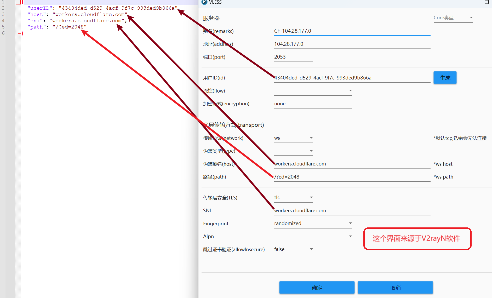

批量构建 cloudflare workers 的 vless 节点，提供IP地址/域名、端口(可以省略，在exe程序操作设置)，就可以实现一条vless链接，扩展无数条vless链接。

### 1、修改配置config.json文件的信息，打开自己的vless节点找



`conf.json`文件（填写格式如下，内容是傻填的，一定要根据自己的修改，没有值的就填""）：

```json
{
  "userID": "43404ded-d529-4acf-9f7c-993ded9b866a",
  "host": "workers.cloudflare.com",
  "sni": "workers.cloudflare.com",
  "path": "/?ed=2048"
}
```

注意：填写host值，如果使用`*.workers.dev`的域名，程序默认生成的vless链接没有tls加密的；添加非`workers.dev`后缀的域名，才能生成有tls加密信息的链接。

#### 其它文件：

（1）**ip.txt文件**：存放待写入vless节点的IP或域名，一行写一个，该文件可以自己创建；

（2）**output.txt文件**：程序运行后的结果存放到这里，文件不用自己创建，自动生成的。

### 2、程序运行支持的数据格式

也就是，在`ip.txt`文件中写什么样的数据，程序运行才能用？


### 3、程序运行效果截图(含3个exe程序)


**p.s. 使用程序生成大量的vless节点，复制到V2rayN等软件测试，有用的节点保留，没用的删除。**
