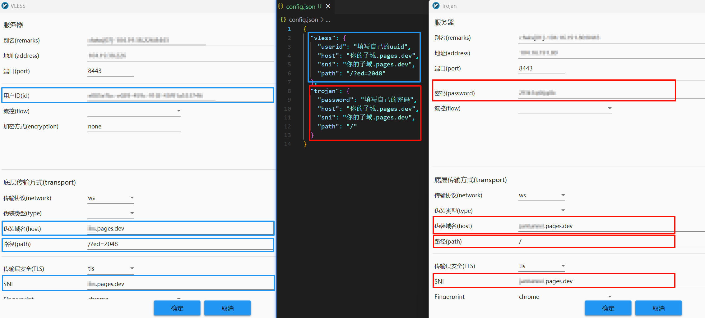

【rust语言编写的】批量构建 cf workers 的 vless 节点，提供IP或域名到ip.txt文件，运行[exe程序](https://github.com/juerson/build_vless_nodes_rust/releases/download/1.0/build_vless_nodes-x86_64-pc-windows-msvc.exe)按提示操作即可。

## 1、修改配置config.json文件的信息



注意：填写host值，如果使用`*.workers.dev`的域名，程序默认生成的vless链接没有tls加密的；添加非`workers.dev`后缀的域名，才能生成有tls加密信息的链接。

## 2、程序运行效果截图


**我不是程序员，需要哪些文件即可？**


config.json文件（填写格式如下）：

```json
{
  "userID": "d342d11e-d424-4583-b36e-524ab1f0afa4",
  "host": "github.com",
  "sni": "github.com"
}
```

**ip.txt文件**：存放待写vless节点的IP或域名，一行写一个，文件可以自己创建；

**output.txt文件**：程序最终生成的结果存放到这里，文件不用自己创建，自动生成的。

**p.s. 使用该程序生成大量的vless节点，再将vless节点导入v2rayN等软件测试，有用的节点保留，没用的删除。**

